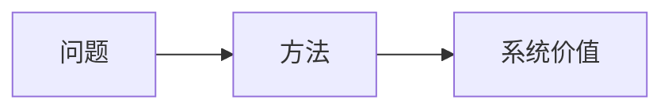
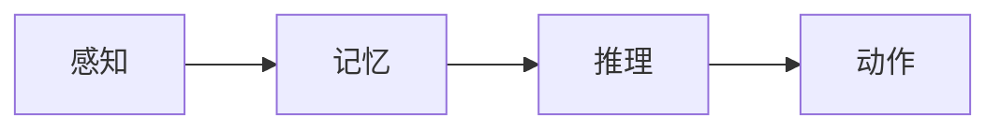

# CLI 命令模板

执行该 skill 时，优先参考这些模式。重点不是“抓前几篇”，而是**先建立完整候选池，再筛代表论文**。

## 0. 先做运行时 Topic Plan

正式运行前，先从用户输入中显式整理出：

- `aliases`：至少一个英文标准表述，必要时再补缩写
- `subtopics`：2-5 个可独立检索的子方向
- `keywords`：围绕主题和子方向展开的检索词

推荐命令骨架（默认两阶段缓存工作流）：

### 阶段 A：预热 cache（联网环境）

```bash
python scripts/prefetch_topic_cache.py "<topic>" \
  --cache-dir /tmp/research_papers_cache \
  --aliases "<canonical english>,<optional acronym>" \
  --subtopics "<subtopic 1>,<subtopic 2>,<subtopic 3>" \
  --keywords "<keyword 1>,<keyword 2>,<keyword 3>"
```

### 阶段 B：只读 cache 生成 survey（沙箱环境）

```bash
python scripts/survey_topic.py "<topic>" \
  --cache-dir /tmp/research_papers_cache \
  --cache-mode read-only \
  --aliases "<canonical english>,<optional acronym>" \
  --subtopics "<subtopic 1>,<subtopic 2>,<subtopic 3>" \
  --keywords "<keyword 1>,<keyword 2>,<keyword 3>" \
  --json-output /tmp/research_papers.json \
  -o /tmp/research_papers.md
```

说明：

- 对中文主题，不要把英文 alias 的推断完全交给脚本 fallback
- `--aliases` 是检索主锚点，`--keywords` 用来扩展候选池，`--subtopics` 决定综述结构
- 第二阶段务必复用第一阶段的 `cache-dir` 和同一组关键参数，否则会 cache miss
- 如果想生成后删缓存，可在第二阶段追加 `--delete-cache-after-run`

## 1. 先扫六大会 Venue

默认六大会：

- `CVPR`
- `ICCV`
- `ECCV`
- `ICML`
- `ICLR`
- `NeurIPS`

### 推荐做法：先拉 venue-year feed，再本地筛关键词

以下命令默认在 `skills/research-papers/` 目录执行：

```bash
python ../papers-cool-venue-reader/scripts/papers_cool.py feed CVPR --year 2025 --limit 5000 --json
python ../papers-cool-venue-reader/scripts/papers_cool.py feed ICCV --year 2023 --limit 5000 --json
python ../papers-cool-venue-reader/scripts/papers_cool.py feed ECCV --year 2024 --limit 5000 --json
python ../papers-cool-venue-reader/scripts/papers_cool.py feed ICML --year 2025 --limit 5000 --json
python ../papers-cool-venue-reader/scripts/papers_cool.py feed ICLR --year 2025 --limit 5000 --json
python ../papers-cool-venue-reader/scripts/papers_cool.py feed NeurIPS --year 2024 --limit 5000 --json
```

说明：

- 这里的 `5000` 是技术上的扫描上限，不是 top-k 筛选逻辑
- 不要用 `--limit 8`、`--limit 10` 这种小值直接截断候选池

### 如果只想快速试探，也可以直接 query

```bash
python ../papers-cool-venue-reader/scripts/papers_cool.py venue CVPR --year 2025 --query "3D affordance grounding" --limit 5000 --json
python ../papers-cool-venue-reader/scripts/papers_cool.py venue ICLR --year 2024 --query "navigation world model" --limit 5000 --json
python ../papers-cool-venue-reader/scripts/papers_cool.py venue NeurIPS --year 2024 --query "vision-language-action model" --limit 5000 --json
```

但正式写综述时，更推荐 feed 全扫后本地过滤。

## 2. 选中论文后看 papers.cool 元数据

```bash
python ../papers-cool-venue-reader/scripts/papers_cool.py paper "<slug>" --json
python ../papers-cool-venue-reader/scripts/papers_cool.py brief "<slug>" --json
```

如果 papers.cool 暴露了官方链接或 PDF，继续看：

- 官方 HTML 页面
- 官方 PDF

如果需要补一点 PDF 文字：

```bash
python ../papers-cool-venue-reader/scripts/papers_cool.py brief "<slug>" --download-pdf --json
```

注意：

- Venue 论文如果只看到了 abstract，就不能把方法细节写得过于确定
- 可以写“从摘要看，这篇工作更像是……”

## 3. 再补 ArXiv，默认限制 200

```bash
deepxiv search "3D scene memory" --date-from <当前年-3>-01-01 --limit 200 --format json
deepxiv search "vision-language navigation" --date-from <当前年-3>-01-01 --limit 200 --format json
deepxiv search "vision-language-action model" --date-from <当前年-3>-01-01 --limit 200 --format json
```

默认脚本约束：

- 每个 topic 的去重候选池至少要超过 100 篇
- 每个 topic 最终至少保留 50 篇论文
- Python 脚本会用多线程并发抓取 venue / arXiv 候选和论文详情

## 4. ArXiv 精读命令

先看结构，再看关键 section：

```bash
deepxiv paper <arxiv_id> --head -f json
deepxiv paper <arxiv_id> --brief -f json
deepxiv paper <arxiv_id> --section Introduction
deepxiv paper <arxiv_id> --section Methods
deepxiv paper <arxiv_id> --section Results
```

如果论文是该 topic 的核心代表作，再继续：

```bash
deepxiv paper <arxiv_id> --preview
deepxiv paper <arxiv_id> --raw
```

## 5. 逐篇解读时要回答的问题

写每篇论文前，至少先回答这些：

1. 这篇论文在解决什么问题？
2. 它的核心方法接口是什么？
3. 它在整个 topic 里处于哪一层？
4. 它的价值更偏“能力件”、“系统件”还是“评测件”？
5. 它值得被你放进综述的真正理由是什么？

## 6. 图示建议

默认每篇论文都应给一张 Mermaid 理解图，但前提是你已经看懂论文。

常见图法：





不要把图示当装饰。图的目标是帮助解释：

- 输入是什么
- 中间表示是什么
- 最终对系统有什么帮助

## 7. 直观例子建议

每篇论文都尽量补一个直观例子，帮助读者快速理解它到底在干什么。

例如：

- 导航论文：给一个机器人在陌生环境里听指令找房间的场景
- grounding 论文：给一个“找到桌角红杯子并抓取”的场景
- world model 论文：给一个“先预测动作后果，再决定怎么做”的场景

## 8. 最后写总结时要避免的错误

不要：

- 只复述论文列表
- 只说“这个方向很重要”
- 只写“未来可以继续研究”

要写：

- 哪些主线已经形成
- 哪些接口还没打通
- 哪些论文值得精读，为什么
- 哪些方向最可能继续演化成更完整系统
