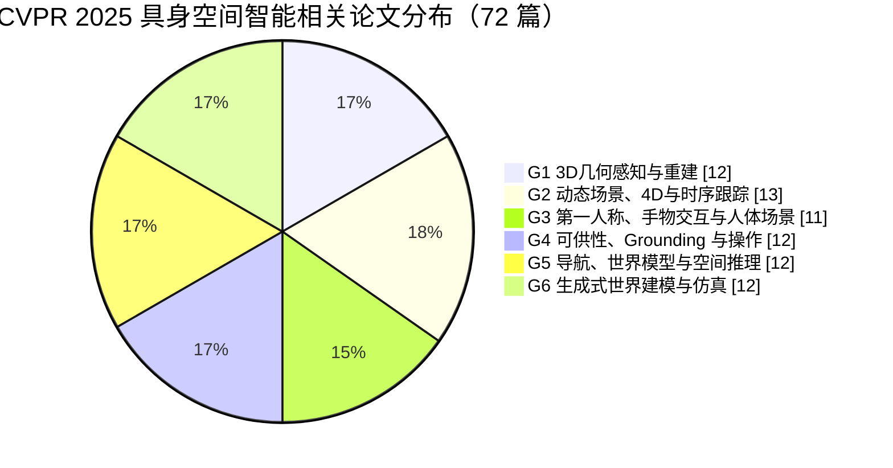

# CVPR 2025 具身空间智能论文调研（72 篇，按能力栈系统整理）

## 0. 如何读这份报告

- 时间范围：只看 `CVPR 2025`。
- 收录规模：基于 `papers.cool` 的 `CVPR.2025` 全量 Atom feed，共检查 `2871` 条会议记录，最终筛出 `72` 篇与“具身空间智能”强相关或关键支撑相关的论文。
- 这次的整理逻辑，刻意参考了 `VLA_空间智能_2024_2026_论文调研.md` 的写法：**先给结论，再给总览，再做系统分组整理，最后给精读路径和总体判断**。
- 但这份报告和那份参考文档也有一个关键差异：参考文档是跨年份、跨 venue 的“Benchmark + Method”总表；这份报告只看单一 venue、单一年份，所以更适合按**能力栈**来拆，而不是按 benchmark / method 二分。
- 本文的标题链接默认都指向 `papers.cool` 对应论文页，便于继续点到官方 `CVF` 页面和 PDF。
- 这次版本比上一版更宽，也更系统。上一版偏窄的主要原因是只看到了 venue 页面首屏可见结果，没有完整利用 `CVPR 2025` 的全量 feed。

## 1. 结论先看

- 严格说，`CVPR 2025` 里直接把自己命名成 “embodied spatial intelligence” 的论文并不多；但如果按能力栈去拆，`CVPR 2025` 已经能拼出一张相当完整的**具身空间智能论文地图**。
- 这张地图最强的部分不是“端到端机器人大模型”本身，而是它的上游和中游：`3D 几何感知`、`动态 4D 场景建模`、`第一人称手物交互`、`affordance / grounding`、`导航与空间推理`、`生成式世界模型与仿真`。
- 如果把具身空间智能理解成“智能体能否形成稳定、可更新、可操作、可推演的空间世界模型，并把它用于行动”，那么 `CVPR 2025` 最值得关注的不是少数几个写了 `embodied` 的标题，而是整条能力链条。
- 这 72 篇论文里，最像主线骨架的工作主要集中在这 12 篇：
  1. [VGGT: Visual Geometry Grounded Transformer](https://papers.cool/venue/Wang_VGGT_Visual_Geometry_Grounded_Transformer@CVPR2025@CVF)
  2. [BIP3D: Bridging 2D Images and 3D Perception for Embodied Intelligence](https://papers.cool/venue/Lin_BIP3D_Bridging_2D_Images_and_3D_Perception_for_Embodied_Intelligence@CVPR2025@CVF)
  3. [MegaSaM: Accurate, Fast and Robust Structure and Motion from Casual Dynamic Videos](https://papers.cool/venue/Li_MegaSaM_Accurate_Fast_and_Robust_Structure_and_Motion_from_Casual@CVPR2025@CVF)
  4. [Stereo4D: Learning How Things Move in 3D from Internet Stereo Videos](https://papers.cool/venue/Jin_Stereo4D_Learning_How_Things_Move_in_3D_from_Internet_Stereo@CVPR2025@CVF)
  5. [HOT3D: Hand and Object Tracking in 3D from Egocentric Multi-View Videos](https://papers.cool/venue/Banerjee_HOT3D_Hand_and_Object_Tracking_in_3D_from_Egocentric_Multi-View@CVPR2025@CVF)
  6. [Grounding 3D Object Affordance with Language Instructions, Visual Observations and Interactions](https://papers.cool/venue/Zhu_Grounding_3D_Object_Affordance_with_Language_Instructions_Visual_Observations_and@CVPR2025@CVF)
  7. [GREAT: Geometry-Intention Collaborative Inference for Open-Vocabulary 3D Object Affordance Grounding](https://papers.cool/venue/Shao_GREAT_Geometry-Intention_Collaborative_Inference_for_Open-Vocabulary_3D_Object_Affordance_Grounding@CVPR2025@CVF)
  8. [OmniManip: Towards General Robotic Manipulation via Object-Centric Interaction Primitives as Spatial Constraints](https://papers.cool/venue/Pan_OmniManip_Towards_General_Robotic_Manipulation_via_Object-Centric_Interaction_Primitives_as@CVPR2025@CVF)
  9. [RoomTour3D: Geometry-Aware Video-Instruction Tuning for Embodied Navigation](https://papers.cool/venue/Han_RoomTour3D_Geometry-Aware_Video-Instruction_Tuning_for_Embodied_Navigation@CVPR2025@CVF)
  10. [3D-Mem: 3D Scene Memory for Embodied Exploration and Reasoning](https://papers.cool/venue/Yang_3D-Mem_3D_Scene_Memory_for_Embodied_Exploration_and_Reasoning@CVPR2025@CVF)
  11. [Navigation World Models](https://papers.cool/venue/Bar_Navigation_World_Models@CVPR2025@CVF)
  12. [DynScene: Scalable Generation of Dynamic Robotic Manipulation Scenes for Embodied AI](https://papers.cool/venue/Lee_DynScene_Scalable_Generation_of_Dynamic_Robotic_Manipulation_Scenes_for_Embodied@CVPR2025@CVF)
- 如果你当前更关心 `point / mask / grounding / affordance / spatial reasoning`，优先看 `G1 + G4 + G5`；如果你关心“世界模型和仿真数据如何反哺具身学习”，优先看 `G2 + G6`。
- `CVPR 2025` 的最大机会，不在于已经出现了一个终局系统，而在于各个关键零件已经明显成形；最大短板，则还是**从感知、建图、推理到动作执行的统一闭环不够强**。

## 2. 总览

### 2.1 一张图看 CVPR 2025 的“具身空间智能能力栈”

### 2.2 为什么这次按这 6 类来整理

- `CVPR` 本质上还是视觉会议，所以真正直接写“机器人执行策略”的论文并不是主体；更常见的是给具身系统补齐某一层关键视觉能力。
- 因此，我这次不是只按标题里有没有 `embodied`、`robot` 来收，而是按下面这条链路来筛：
  - `3D 几何底座`
  - `动态世界与 4D 时序建模`
  - `第一人称交互与手物关系`
  - `可供性 / grounding / manipulation 接口`
  - `导航、记忆、空间推理与视觉 agent`
  - `世界模型、仿真与数据生成`
- 换句话说，这份报告里的“具身空间智能”不是一个狭义标签，而是一套**支撑具身系统成立的视觉能力栈**。

### 2.3 72 篇论文的分布

### 2.4 能力矩阵

| 能力维度 | 你真正关心的问题 | 优先看哪一类 | 代表论文 |
| --- | --- | --- | --- |
| 3D 几何表征 | 智能体有没有稳定的世界坐标、深度和几何底座？ | `G1` | `VGGT`, `MUSt3R`, `BIP3D` |
| 动态世界理解 | 智能体能不能持续理解“谁在动、怎么动、未来会怎样”？ | `G2` | `MegaSaM`, `Stereo4D`, `4DTAM`, `FreeGave` |
| 第一人称操作观察 | 智能体能不能从第一视角学到手、物体、接触和意图？ | `G3` | `HOT3D`, `HaWoR`, `EgoPressure` |
| 可供性与操作接口 | 智能体能不能把语言目标落到“该抓哪里、该碰哪里、该怎么操作”？ | `G4` | `Grounding 3D Object Affordance`, `GREAT`, `SeqAfford`, `OmniManip` |
| 导航、记忆与空间推理 | 智能体能不能在长时序探索中记住环境、推断位置、按指令前进？ | `G5` | `RoomTour3D`, `3D-Mem`, `Navigation World Models` |
| 世界模型与仿真 | 智能体有没有一个可控、可生成、可回放、可扩展的数据世界？ | `G6` | `GEN3C`, `DriveDreamer4D`, `DynScene` |

## 3. 72 篇论文系统整理

### 3.1 G1 3D几何感知与重建（12 篇）

这一组回答的问题最底层，也最关键：**具身系统有没有可靠的 3D 世界底座**。如果连相机位姿、深度、点图、跨视角对齐都不稳，那么后面的导航、操作和空间推理都会漂。

| 论文 | 方向定位 | 与具身空间智能的关系 | 关键价值 |
| --- | --- | --- | --- |
| [VGGT: Visual Geometry Grounded Transformer](https://papers.cool/venue/Wang_VGGT_Visual_Geometry_Grounded_Transformer@CVPR2025@CVF) | 统一 3D 几何基础模型 | 直接输出相机位姿、深度、点图和点轨迹，是世界模型底座 | 很像 `CVPR 2025` 的几何 foundation model |
| [MUSt3R: Multi-view Network for Stereo 3D Reconstruction](https://papers.cool/venue/Cabon_MUSt3R_Multi-view_Network_for_Stereo_3D_Reconstruction@CVPR2025@CVF) | 多视图稠密 3D 重建 | 把任意图像集合转成可用的 3D 对齐结果，适合开放场景建图 | 对 embodied map-building 很实用 |
| [Pow3R: Empowering Unconstrained 3D Reconstruction with Camera and Scene Priors](https://papers.cool/venue/Jang_Pow3R_Empowering_Unconstrained_3D_Reconstruction_with_Camera_and_Scene_Priors@CVPR2025@CVF) | 带先验的开放式 3D 重建 | 将相机和场景先验纳入测试阶段，提高重建稳健性 | 强在“有先验就更好用” |
| [FoundationStereo: Zero-Shot Stereo Matching](https://papers.cool/venue/Wen_FoundationStereo_Zero-Shot_Stereo_Matching@CVPR2025@CVF) | 零样本立体匹配 | 解决跨域深度泛化，是机器人换环境后仍能估深的关键 | 代表 stereo foundation 化趋势 |
| [Dual Exposure Stereo for Extended Dynamic Range 3D Imaging](https://papers.cool/venue/Choi_Dual_Exposure_Stereo_for_Extended_Dynamic_Range_3D_Imaging@CVPR2025@CVF) | 高动态范围立体成像 | 面向复杂光照下稳定获取深度，支撑真实环境感知 | 解决过曝和欠曝导致的 3D 失真 |
| [Zero-Shot Novel View and Depth Synthesis with Multi-View Geometric Diffusion](https://papers.cool/venue/Guizilini_Zero-Shot_Novel_View_and_Depth_Synthesis_with_Multi-View_Geometric_Diffusion@CVPR2025@CVF) | 多视图几何扩散 | 同时建模新视角与深度，利于从稀疏观测补全空间 | 适合 sparse-view 具身场景重建 |
| [Camera Resection from Known Line Pencils and a Radially Distorted Scanline](https://papers.cool/venue/Dibene_Camera_Resection_from_Known_Line_Pencils_and_a_Radially_Distorted@CVPR2025@CVF) | 特殊成像条件下位姿估计 | 处理扫描线和畸变条件下的绝对位姿求解 | 是底层定位问题的精细几何解 |
| [AnyMap: Learning a General Camera Model for Structure-from-Motion with Unknown Distortion in Dynamic Scenes](https://papers.cool/venue/Dal_Cin_AnyMap_Learning_a_General_Camera_Model_for_Structure-from-Motion_with_Unknown@CVPR2025@CVF) | 泛化相机模型 SfM | 在动态场景和未知畸变下仍能做结构恢复 | 对广角和非理想相机更实用 |
| [Joint Optimization of Neural Radiance Fields and Continuous Camera Motion from a Monocular Video](https://papers.cool/venue/Nguyen_Joint_Optimization_of_Neural_Radiance_Fields_and_Continuous_Camera_Motion@CVPR2025@CVF) | 单目视频 NeRF 与相机联合优化 | 在弱位姿条件下恢复场景和相机运动 | 有利于低成本场景建模 |
| [Opportunistic Single-Photon Time of Flight](https://papers.cool/venue/Nousias_Opportunistic_Single-Photon_Time_of_Flight@CVPR2025@CVF) | 新型 3D 传感路线 | 扩展主动和被动 3D 感知边界 | 展示具身 3D sensing 的新可能 |
| [BIP3D: Bridging 2D Images and 3D Perception for Embodied Intelligence](https://papers.cool/venue/Lin_BIP3D_Bridging_2D_Images_and_3D_Perception_for_Embodied_Intelligence@CVPR2025@CVF) | 从 2D 到 3D 的 embodied perception bridge | 直接把二维图像能力桥接到具身 3D 感知 | 是“给 embodied intelligence 补 3D”的直接代表 |
| [DOF-GS: Adjustable Depth-of-Field 3D Gaussian Splatting for Post-Capture Refocusing, Defocus Rendering and Blur Removal](https://papers.cool/venue/Wang_DOF-GS_Adjustable_Depth-of-Field_3D_Gaussian_Splatting_for_Post-Capture_Refocusing_Defocus@CVPR2025@CVF) | 可调景深 3DGS | 让重建结果更贴近真实成像与聚焦过程 | 对真实机器人视觉建模更友好 |

### 3.2 G2 动态场景、4D与时序跟踪（13 篇）

这组论文讨论的不是“世界是什么”，而是**世界如何变化**。对于具身智能来说，真正困难的从来不是静态室内图，而是动态、遮挡、非刚体、长时序、甚至带物理规律的真实世界。

| 论文 | 方向定位 | 与具身空间智能的关系 | 关键价值 |
| --- | --- | --- | --- |
| [MegaSaM: Accurate, Fast and Robust Structure and Motion from Casual Dynamic Videos](https://papers.cool/venue/Li_MegaSaM_Accurate_Fast_and_Robust_Structure_and_Motion_from_Casual@CVPR2025@CVF) | 动态视频 SfM / SLAM | 在动态场景下稳健恢复相机和深度，是现实移动体的刚需 | 把几何恢复推进到“随手拍动态视频” |
| [Stereo4D: Learning How Things Move in 3D from Internet Stereo Videos](https://papers.cool/venue/Jin_Stereo4D_Learning_How_Things_Move_in_3D_from_Internet_Stereo@CVPR2025@CVF) | 从网络双目视频学 4D 运动 | 学习物体如何在 3D 中运动，支撑动态世界模型 | 兼具规模与 4D 意义 |
| [4DTAM: Non-Rigid Tracking and Mapping via Dynamic Surface Gaussians](https://papers.cool/venue/Matsuki_4DTAM_Non-Rigid_Tracking_and_Mapping_via_Dynamic_Surface_Gaussians@CVPR2025@CVF) | 非刚体 tracking and mapping | 对动态非刚体场景做在线跟踪与建图 | 对人、软体和形变场景很关键 |
| [SplatFlow: Self-Supervised Dynamic Gaussian Splatting in Neural Motion Flow Field for Autonomous Driving](https://papers.cool/venue/Sun_SplatFlow_Self-Supervised_Dynamic_Gaussian_Splatting_in_Neural_Motion_Flow_Field@CVPR2025@CVF) | 自动驾驶动态 3DGS | 自监督表达街景动态流场，服务行动决策 | 把动态高斯表达推向车载应用 |
| [FreeTimeGS: Free Gaussian Primitives at Anytime Anywhere for Dynamic Scene Reconstruction](https://papers.cool/venue/Wang_FreeTimeGS_Free_Gaussian_Primitives_at_Anytime_Anywhere_for_Dynamic_Scene@CVPR2025@CVF) | 任意时刻动态重建 | 提升复杂运动重建的时序自由度 | 适合长期动态场景回放与理解 |
| [DeSiRe-GS: 4D Street Gaussians for Static-Dynamic Decomposition and Surface Reconstruction for Urban Driving Scenes](https://papers.cool/venue/Peng_DeSiRe-GS_4D_Street_Gaussians_for_Static-Dynamic_Decomposition_and_Surface_Reconstruction@CVPR2025@CVF) | 城市场景静动分解 | 分离静态结构与动态物体，利于导航和预测 | 非常贴近城市移动体感知 |
| [TimeTracker: Event-based Continuous Point Tracking for Video Frame Interpolation with Non-linear Motion](https://papers.cool/venue/Liu_TimeTracker_Event-based_Continuous_Point_Tracking_for_Video_Frame_Interpolation_with@CVPR2025@CVF) | 事件相机连续点跟踪 | 提供高时间分辨率运动追踪能力 | 对高速交互和低延迟感知重要 |
| [GRAE-3DMOT: Geometry Relation-Aware Encoder for Online 3D Multi-Object Tracking](https://papers.cool/venue/Kim_GRAE-3DMOT_Geometry_Relation-Aware_Encoder_for_Online_3D_Multi-Object_Tracking@CVPR2025@CVF) | 几何关系增强 3D MOT | 为 embodied agent 提供对象级时序状态 | 适合多主体动态场景 |
| [Mamba4D: Efficient 4D Point Cloud Video Understanding with Disentangled Spatial-Temporal State Space Models](https://papers.cool/venue/Liu_Mamba4D_Efficient_4D_Point_Cloud_Video_Understanding_with_Disentangled_Spatial-Temporal@CVPR2025@CVF) | 4D 点云视频 backbone | 让时空点云理解更高效 | 是 4D perception backbone 候选 |
| [GS-DiT: Advancing Video Generation with Dynamic 3D Gaussian Fields through Efficient Dense 3D Point Tracking](https://papers.cool/venue/Bian_GS-DiT_Advancing_Video_Generation_with_Dynamic_3D_Gaussian_Fields_through@CVPR2025@CVF) | 动态 3DGS 视频生成 | 用 3D 点跟踪支撑 4D video control | 连接动态表示与生成 |
| [MoDec-GS: Global-to-Local Motion Decomposition and Temporal Interval Adjustment for Compact Dynamic 3D Gaussian Splatting](https://papers.cool/venue/Kwak_MoDec-GS_Global-to-Local_Motion_Decomposition_and_Temporal_Interval_Adjustment_for_Compact@CVPR2025@CVF) | 紧凑型动态 3DGS | 提升表示紧凑性和长时序可用性 | 更适合工程部署 |
| [FreeGave: 3D Physics Learning from Dynamic Videos by Gaussian Velocity](https://papers.cool/venue/Li_FreeGave_3D_Physics_Learning_from_Dynamic_Videos_by_Gaussian_Velocity@CVPR2025@CVF) | 从视频学 3D 物理 | 把动态视频提升到物理机理建模 | 从“看见运动”走向“理解运动” |
| [FluidNexus: 3D Fluid Reconstruction and Prediction from a Single Video](https://papers.cool/venue/Gao_FluidNexus_3D_Fluid_Reconstruction_and_Prediction_from_a_Single_Video@CVPR2025@CVF) | 单视频 3D 流体重建与预测 | 面向极复杂动态物理场景的状态恢复 | 展示 4D 物理世界建模边界 |

### 3.3 G3 第一人称、手物交互与人体场景（11 篇）

这一组最接近“人如何在世界里操作东西”。对于具身学习来说，第一人称视角和手物交互是极有价值的数据源，因为它天然带有**目标、动作、接触、约束**。

| 论文 | 方向定位 | 与具身空间智能的关系 | 关键价值 |
| --- | --- | --- | --- |
| [HOT3D: Hand and Object Tracking in 3D from Egocentric Multi-View Videos](https://papers.cool/venue/Banerjee_HOT3D_Hand_and_Object_Tracking_in_3D_from_Egocentric_Multi-View@CVPR2025@CVF) | 第一人称手物 3D tracking 数据集 | 是具身交互最关键的数据底座之一 | 多视角 ego hand-object 数据很稀缺 |
| [HaWoR: World-Space Hand Motion Reconstruction from Egocentric Videos](https://papers.cool/venue/Zhang_HaWoR_World-Space_Hand_Motion_Reconstruction_from_Egocentric_Videos@CVPR2025@CVF) | 世界坐标手运动重建 | 从相机系升级到世界系手运动，更直接服务操作建模 | 对 imitation 和 reference 更友好 |
| [Dyn-HaMR: Recovering 4D Interacting Hand Motion from a Dynamic Camera](https://papers.cool/venue/Yu_Dyn-HaMR_Recovering_4D_Interacting_Hand_Motion_from_a_Dynamic_Camera@CVPR2025@CVF) | 动态相机下的 4D 手交互恢复 | 处理真实佩戴式和移动相机条件 | 更贴近真实 egocentric 采集 |
| [EgoPressure: A Dataset for Hand Pressure and Pose Estimation in Egocentric Vision](https://papers.cool/venue/Zhao_EgoPressure_A_Dataset_for_Hand_Pressure_and_Pose_Estimation_in@CVPR2025@CVF) | 手部压力与姿态数据集 | 把接触强度纳入第一人称感知 | 补足“看见接触”和“理解接触”之间差距 |
| [Object-Shot Enhanced Grounding Network for Egocentric Video](https://papers.cool/venue/Feng_Object-Shot_Enhanced_Grounding_Network_for_Egocentric_Video@CVPR2025@CVF) | Ego video grounding | 在第一人称视频里找操作对象和关键时刻 | 对 task-aware perception 有直接价值 |
| [EgoTextVQA: Towards Egocentric Scene-Text Aware Video Question Answering](https://papers.cool/venue/Zhou_EgoTextVQA_Towards_Egocentric_Scene-Text_Aware_Video_Question_Answering@CVPR2025@CVF) | 第一人称场景文字问答 | 让 embodied assistant 学会读取环境文字 | 对导航、工业和日常任务很实用 |
| [How Do I Do That? Synthesizing 3D Hand Motion and Contacts for Everyday Interactions](https://papers.cool/venue/Prakash_How_Do_I_Do_That_Synthesizing_3D_Hand_Motion_and@CVPR2025@CVF) | 3D 手运动与接触合成 | 为 everyday interaction 提供动作先验 | 可服务操作演示生成 |
| [TASTE-Rob: Advancing Video Generation of Task-Oriented Hand-Object Interaction for Generalizable Robotic Manipulation](https://papers.cool/venue/Zhao_TASTE-Rob_Advancing_Video_Generation_of_Task-Oriented_Hand-Object_Interaction_for_Generalizable@CVPR2025@CVF) | 任务导向手物视频生成 | 用生成视频扩充机器人模仿学习数据 | 把 hand-object generation 连接到 manipulation |
| [ManiVideo: Generating Hand-Object Manipulation Video with Dexterous and Generalizable Grasping](https://papers.cool/venue/Pang_ManiVideo_Generating_Hand-Object_Manipulation_Video_with_Dexterous_and_Generalizable_Grasping@CVPR2025@CVF) | 灵巧抓取视频生成 | 生成稳定的双手和物体操作视频 | 对 dexterous data generation 有价值 |
| [CORE4D: A 4D Human-Object-Human Interaction Dataset for Collaborative Object REarrangement](https://papers.cool/venue/Liu_CORE4D_A_4D_Human-Object-Human_Interaction_Dataset_for_Collaborative_Object_REarrangement@CVPR2025@CVF) | 人-物-人协作数据集 | 支撑协作搬运和整理等多主体任务 | 贴近家庭和协作机器人 |
| [GaPT-DAR: Category-level Garments Pose Tracking via Integrated 2D Deformation and 3D Reconstruction](https://papers.cool/venue/Zhang_GaPT-DAR_Category-level_Garments_Pose_Tracking_via_Integrated_2D_Deformation_and@CVPR2025@CVF) | 柔性服饰形变跟踪 | 补足布料和衣物这类难操作对象 | 对柔性 manipulation 很重要 |

### 3.4 G4 可供性、Grounding 与操作（12 篇）

这组论文最接近“行动接口”。具身空间智能最终不能只回答“这个东西在哪”，而要进一步回答：**哪里能抓、哪里能碰、应该按什么顺序操作、语言如何落到具体空间区域**。

| 论文 | 方向定位 | 与具身空间智能的关系 | 关键价值 |
| --- | --- | --- | --- |
| [Grounding 3D Object Affordance with Language Instructions, Visual Observations and Interactions](https://papers.cool/venue/Zhu_Grounding_3D_Object_Affordance_with_Language_Instructions_Visual_Observations_and@CVPR2025@CVF) | 3D 可供性定位 | 直接把语言、观察和交互映射到可操作区域 | 是 perception-to-action 接口代表作 |
| [GREAT: Geometry-Intention Collaborative Inference for Open-Vocabulary 3D Object Affordance Grounding](https://papers.cool/venue/Shao_GREAT_Geometry-Intention_Collaborative_Inference_for_Open-Vocabulary_3D_Object_Affordance_Grounding@CVPR2025@CVF) | 开放词汇 3D affordance grounding | 将几何和意图联合推理 | 更强泛化到开放指令 |
| [SeqAfford: Sequential 3D Affordance Reasoning via Multimodal Large Language Model](https://papers.cool/venue/Yu_SeqAfford_Sequential_3D_Affordance_Reasoning_via_Multimodal_Large_Language_Model@CVPR2025@CVF) | 顺序可供性推理 | 不只找一个点，而是推理多步操作顺序 | 很适合复杂 manipulation |
| [OmniManip: Towards General Robotic Manipulation via Object-Centric Interaction Primitives as Spatial Constraints](https://papers.cool/venue/Pan_OmniManip_Towards_General_Robotic_Manipulation_via_Object-Centric_Interaction_Primitives_as@CVPR2025@CVF) | 对象中心 interaction primitives | 把空间约束写成操作原语 | 对通用 manipulation 很关键 |
| [RoboSpatial: Teaching Spatial Understanding to 2D and 3D Vision-Language Models for Robotics](https://papers.cool/venue/Song_RoboSpatial_Teaching_Spatial_Understanding_to_2D_and_3D_Vision-Language_Models@CVPR2025@CVF) | 机器人 VLM 空间能力增强 | 直接补机器人 VLM 的空间理解短板 | 连接 perception 与 robot decision |
| [Robotic Visual Instruction](https://papers.cool/venue/Li_Robotic_Visual_Instruction@CVPR2025@CVF) | 视觉指令交互 | 用视觉示意替代纯语言歧义 | 适合高精度空间控制 |
| [VidBot: Learning Generalizable 3D Actions from In-the-Wild 2D Human Videos for Zero-Shot Robotic Manipulation](https://papers.cool/venue/Chen_VidBot_Learning_Generalizable_3D_Actions_from_In-the-Wild_2D_Human_Videos@CVPR2025@CVF) | 从野外人类视频学 3D 动作 | 降低真实机器人数据依赖 | 是“借人类视频教机器人”的强思路 |
| [3D-MVP: 3D Multiview Pretraining for Manipulation](https://papers.cool/venue/Qian_3D-MVP_3D_Multiview_Pretraining_for_Manipulation@CVPR2025@CVF) | Manipulation 3D 多视图预训练 | 用 3D-aware pretraining 提升下游操作 | 说明预训练范式正从 2D 转向 3D |
| [Two by Two: Learning Multi-Task Pairwise Objects Assembly for Generalizable Robot Manipulation](https://papers.cool/venue/Qi_Two_by_Two_Learning_Multi-Task_Pairwise_Objects_Assembly_for_Generalizable@CVPR2025@CVF) | 配对装配操作 | 面向家具装配和配对插接等 3D 任务 | 很贴近未来家用机器人能力 |
| [Reasoning Mamba: Hypergraph-Guided Region Relation Calculating for Weakly Supervised Affordance Grounding](https://papers.cool/venue/Wang_Reasoning_Mamba_Hypergraph-Guided_Region_Relation_Calculating_for_Weakly_Supervised_Affordance@CVPR2025@CVF) | 弱监督 affordance grounding | 在弱标注下做可供区域推理 | 降低 affordance 数据标注成本 |
| [InteractAnything: Zero-shot Human Object Interaction Synthesis via LLM Feedback and Object Affordance Parsing](https://papers.cool/venue/Zhang_InteractAnything_Zero-shot_Human_Object_Interaction_Synthesis_via_LLM_Feedback_and@CVPR2025@CVF) | 零样本 HOI 合成 | 用 affordance parsing 和 LLM feedback 合成交互 | 可为具身学习生成数据 |
| [Spatial-Temporal Graph Diffusion Policy with Kinematic Modeling for Bimanual Robotic Manipulation](https://papers.cool/venue/Lv_Spatial-Temporal_Graph_Diffusion_Policy_with_Kinematic_Modeling_for_Bimanual_Robotic@CVPR2025@CVF) | 双臂操作 diffusion policy | 把时空图与运动学约束结合 | 面向复杂双臂协同操作 |

### 3.5 G5 导航、世界模型与空间推理（12 篇）

这一组更接近“智能体真的开始在世界里走起来、记起来、推起来”。如果说 `G4` 是操作接口，那么 `G5` 更像是移动智能体的**认知地图、记忆系统和导航推理层**。

| 论文 | 方向定位 | 与具身空间智能的关系 | 关键价值 |
| --- | --- | --- | --- |
| [RoboSense: Large-scale Dataset and Benchmark for Egocentric Robot Perception and Navigation in Crowded and Unstructured Environments](https://papers.cool/venue/Su_RoboSense_Large-scale_Dataset_and_Benchmark_for_Egocentric_Robot_Perception_and@CVPR2025@CVF) | Ego robot perception/navigation 数据集 | 面向拥挤无结构环境的导航感知基准 | 直指真实移动机器人 |
| [RoomTour3D: Geometry-Aware Video-Instruction Tuning for Embodied Navigation](https://papers.cool/venue/Han_RoomTour3D_Geometry-Aware_Video-Instruction_Tuning_for_Embodied_Navigation@CVPR2025@CVF) | 几何感知导航指令微调 | 用 web video-instruction 数据补 VLN | 让 embodied navigation 更可扩展 |
| [3D-Mem: 3D Scene Memory for Embodied Exploration and Reasoning](https://papers.cool/venue/Yang_3D-Mem_3D_Scene_Memory_for_Embodied_Exploration_and_Reasoning@CVPR2025@CVF) | 3D 场景记忆 | 让长时探索和推理拥有 compact memory | 是 embodied memory 的关键拼图 |
| [CityWalker: Learning Embodied Urban Navigation from Web-Scale Videos](https://papers.cool/venue/Liu_CityWalker_Learning_Embodied_Urban_Navigation_from_Web-Scale_Videos@CVPR2025@CVF) | 网络视频城市导航 | 从 web-scale data 学 urban navigation | 把 embodied navigation 从室内推进到城市 |
| [Navigation World Models](https://papers.cool/venue/Bar_Navigation_World_Models@CVPR2025@CVF) | 导航世界模型 | 预测动作后的未来视觉观测 | 直接把 world model 用于导航 |
| [Reasoning in Visual Navigation of End-to-end Trained Agents: A Dynamical Systems Approach](https://papers.cool/venue/Janny_Reasoning_in_Visual_Navigation_of_End-to-end_Trained_Agents_A_Dynamical@CVPR2025@CVF) | 导航推理分析 | 从动力系统角度分析 end-to-end navigation agent | 强在理解系统，而不只是刷指标 |
| [Visual Agentic AI for Spatial Reasoning with a Dynamic API](https://papers.cool/venue/Marsili_Visual_Agentic_AI_for_Spatial_Reasoning_with_a_Dynamic_API@CVPR2025@CVF) | 视觉 agent 空间推理 | 用动态 API 增强复杂空间 reasoning | 是视觉 agent 化的代表尝试 |
| [Ges3ViG: Incorporating Pointing Gestures into Language-Based 3D Visual Grounding for Embodied Reference Understanding](https://papers.cool/venue/Mane_Ges3ViG__Incorporating_Pointing_Gestures_into_Language-Based_3D_Visual_Grounding@CVPR2025@CVF) | 手势加语言的 3D grounding | 让 embodied agent 理解“指这儿”的参照方式 | 对人机协作特别重要 |
| [Coarse Correspondences Boost Spatial-Temporal Reasoning in Multimodal Language Model](https://papers.cool/venue/Liu_Coarse_Correspondences_Boost_Spatial-Temporal_Reasoning_in_Multimodal_Language_Model@CVPR2025@CVF) | 时空推理增强 MLLM | 用对应关系提升 3D 和时间理解 | 对多模态空间推理是通用增益 |
| [Motion-Grounded Video Reasoning: Understanding and Perceiving Motion at Pixel Level](https://papers.cool/venue/Deng_Motion-Grounded_Video_Reasoning_Understanding_and_Perceiving_Motion_at_Pixel_Level@CVPR2025@CVF) | 运动驱动视频推理 | 以像素级可定位结果输出推理结论 | 把 reasoning 落到 motion grounding |
| [Building a Mind Palace: Structuring Environment-Grounded Semantic Graphs for Effective Long Video Analysis with LLMs](https://papers.cool/venue/Huang_Building_a_Mind_Palace_Structuring_Environment-Grounded_Semantic_Graphs_for_Effective@CVPR2025@CVF) | 环境语义图长视频分析 | 用 semantic graph 组织长期环境信息 | 和 embodied memory / semantic map 高度同构 |
| [MASH-VLM: Mitigating Action-Scene Hallucination in Video-LLMs through Disentangled Spatial-Temporal Representations](https://papers.cool/venue/Bae_MASH-VLM_Mitigating_Action-Scene_Hallucination_in_Video-LLMs_through_Disentangled_Spatial-Temporal_Representations@CVPR2025@CVF) | 抑制动作-场景幻觉 | 降低 video-LLM 在 action 和 scene 上的混淆 | 提高具身视频理解可靠性 |

### 3.6 G6 生成式世界建模与仿真（12 篇）

最后这一组不是在直接做 perception，而是在回答另一个越来越重要的问题：**如果真实世界数据不够、交互成本太高，能不能先造一个更可控、更一致、更能服务具身学习的世界**。

| 论文 | 方向定位 | 与具身空间智能的关系 | 关键价值 |
| --- | --- | --- | --- |
| [GEN3C: 3D-Informed World-Consistent Video Generation with Precise Camera Control](https://papers.cool/venue/Ren_GEN3C_3D-Informed_World-Consistent_Video_Generation_with_Precise_Camera_Control@CVPR2025@CVF) | 3D 一致视频生成与相机控制 | 为 world-consistent simulation 提供强生成器 | 适合作为交互式世界模型底座 |
| [AC3D: Analyzing and Improving 3D Camera Control in Video Diffusion Transformers](https://papers.cool/venue/Bahmani_AC3D_Analyzing_and_Improving_3D_Camera_Control_in_Video_Diffusion@CVPR2025@CVF) | 视频扩散 3D 相机控制 | 分析并改进 camera control 精度 | 让生成世界更可控 |
| [VideoScene: Distilling Video Diffusion Model to Generate 3D Scenes in One Step](https://papers.cool/venue/Wang_VideoScene_Distilling_Video_Diffusion_Model_to_Generate_3D_Scenes_in@CVPR2025@CVF) | 一步式 3D scene generation | 从视频扩散蒸馏到 3D 场景生成 | 降低稀疏视角重建成本 |
| [Taming Video Diffusion Prior with Scene-Grounding Guidance for 3D Gaussian Splatting from Sparse Inputs](https://papers.cool/venue/Zhong_Taming_Video_Diffusion_Prior_with_Scene-Grounding_Guidance_for_3D_Gaussian@CVPR2025@CVF) | 稀疏输入 3DGS scene grounding | 用 scene guidance 稳定 sparse-view 建模 | 更贴近真实数据稀缺条件 |
| [Unleashing the Potential of Multi-modal Foundation Models and Video Diffusion for 4D Dynamic Physical Scene Simulation](https://papers.cool/venue/Liu_Unleashing_the_Potential_of_Multi-modal_Foundation_Models_and_Video_Diffusion@CVPR2025@CVF) | 4D 动态物理场景模拟 | 用多模态基础模型和视频扩散做物理模拟 | 是 simulation for embodied AI 的明确表述 |
| [DriveDreamer4D: World Models Are Effective Data Machines for 4D Driving Scene Representation](https://papers.cool/venue/Zhao_DriveDreamer4D_World_Models_Are_Effective_Data_Machines_for_4D_Driving@CVPR2025@CVF) | 驾驶 4D world model | 用 world model 生成 4D driving scenes | 自动驾驶与具身世界模型连接点 |
| [GaussianWorld: Gaussian World Model for Streaming 3D Occupancy Prediction](https://papers.cool/venue/Zuo_GaussianWorld_Gaussian_World_Model_for_Streaming_3D_Occupancy_Prediction@CVPR2025@CVF) | 流式 3D occupancy world model | 用高斯世界模型连续预测占据 | 面向在线场景理解与预测 |
| [DynScene: Scalable Generation of Dynamic Robotic Manipulation Scenes for Embodied AI](https://papers.cool/venue/Lee_DynScene_Scalable_Generation_of_Dynamic_Robotic_Manipulation_Scenes_for_Embodied@CVPR2025@CVF) | 机器人操作场景生成 | 直接为 embodied AI 生成动态 manipulation scenes | 是数据生产工具型论文 |
| [CraftsMan3D: High-fidelity Mesh Generation with 3D Native Diffusion and Interactive Geometry Refiner](https://papers.cool/venue/Li_CraftsMan3D_High-fidelity_Mesh_Generation_with_3D_Native_Diffusion_and_Interactive@CVPR2025@CVF) | 高保真 3D 资产生成 | 为仿真和数据构建提供高质量物体网格 | 对世界资产建设有用 |
| [DNF: Unconditional 4D Generation with Dictionary-based Neural Fields](https://papers.cool/venue/Zhang_DNF_Unconditional_4D_Generation_with_Dictionary-based_Neural_Fields@CVPR2025@CVF) | 无条件 4D generation | 生成随时间变化的 4D 对象 | 对动态世界资产合成有意义 |
| [Motion Prompting: Controlling Video Generation with Motion Trajectories](https://papers.cool/venue/Geng_Motion_Prompting_Controlling_Video_Generation_with_Motion_Trajectories@CVPR2025@CVF) | 轨迹驱动视频生成 | 用 motion trajectories 明确控制动态演化 | 可作为 action-conditioned generation 接口 |
| [Generative Multimodal Pretraining with Discrete Diffusion Timestep Tokens](https://papers.cool/venue/Pan_Generative_Multimodal_Pretraining_with_Discrete_Diffusion_Timestep_Tokens@CVPR2025@CVF) | 生成与理解统一预训练 | 让 MLLM 同时具备生成和理解能力 | 为未来可交互 world model 提供统一骨架 |

## 4. 优先精读顺序

### 4.1 如果你只想抓主线，先读这 15 篇

建议按下面的顺序读，这样会比较像是在“搭一套具身空间智能系统”：

1. `VGGT`
2. `MUSt3R`
3. `BIP3D`
4. `MegaSaM`
5. `Stereo4D`
6. `HOT3D`
7. `Grounding 3D Object Affordance with Language Instructions, Visual Observations and Interactions`
8. `GREAT`
9. `SeqAfford`
10. `OmniManip`
11. `RoomTour3D`
12. `3D-Mem`
13. `Navigation World Models`
14. `GEN3C`
15. `DynScene`

### 4.2 如果你是按任务来读

| 你的目标 | 建议阅读路径 |
| --- | --- |
| 想补 3D 感知和建图底座 | `VGGT -> MUSt3R -> Pow3R -> BIP3D -> MegaSaM` |
| 想做动态世界模型或 4D 场景理解 | `Stereo4D -> 4DTAM -> DeSiRe-GS -> FreeGave -> FluidNexus` |
| 想做第一人称操作观察和 imitation 数据 | `HOT3D -> HaWoR -> EgoPressure -> How Do I Do That? -> TASTE-Rob` |
| 想做 point / mask / affordance / grounding | `Grounding 3D Object Affordance -> GREAT -> SeqAfford -> RoboSpatial -> Reasoning Mamba` |
| 想做机器人操作与通用 manipulation | `OmniManip -> VidBot -> 3D-MVP -> Two by Two -> Spatial-Temporal Graph Diffusion Policy` |
| 想做导航、记忆和空间推理 | `RoboSense -> RoomTour3D -> 3D-Mem -> CityWalker -> Navigation World Models` |
| 想做生成式世界模型和仿真数据引擎 | `GEN3C -> AC3D -> VideoScene -> DriveDreamer4D -> DynScene` |

## 5. 我对 CVPR 2025 具身空间智能方向的总体判断

- 如果把 `CVPR 2025` 放到“具身空间智能”语境下看，它最强的不是一个完整 agent，而是一整条正在变得清晰的视觉能力链。
- 其中最明显的三条趋势是：
  - `3D perception foundation 化`：像 `VGGT`、`FoundationStereo`、`BIP3D` 这类工作，已经不再只是做单点任务，而是在朝“几何基础模型”方向走。
  - `动态世界建模 4D 化`：`MegaSaM`、`Stereo4D`、`4DTAM`、`FreeGave` 这类工作说明研究重心正在从静态重建走向动态理解与动态物理。
  - `perception-to-action 接口更明确`：`Grounding 3D Object Affordance`、`GREAT`、`SeqAfford`、`OmniManip` 这组论文，已经不只是说“看懂场景”，而是在说“怎么把场景理解变成可操作区域和操作约束”。
- 但如果要讲短板，短板也非常明确：
  - 很多论文只覆盖能力链的一段，还不是完整闭环。
  - 记忆、推理、世界模型和动作策略之间，接口仍然不统一。
  - 真实机器人和真实长时序闭环验证，仍然远少于感知或生成论文。
- 所以更准确的判断应该是：**CVPR 2025 已经提供了一张高质量的具身空间智能“零件图”，但还没有给出终局系统图。**
- 如果你的目标是继续做 `具身空间智能 / 空间 grounding / manipulation reasoning`，我建议把这份报告当成一条主线来用：
  - `G1` 负责给你世界坐标和几何底座。
  - `G2` 负责给你动态与时序世界。
  - `G3` 负责给你人类第一人称交互先验。
  - `G4` 负责把语言和目标落到可操作区域。
  - `G5` 负责把世界模型、记忆和导航串起来。
  - `G6` 负责给你可扩展的数据和仿真引擎。

